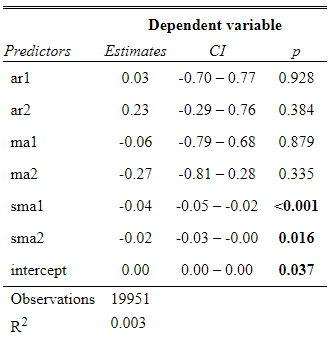

```{r setup, include=FALSE}
knitr::opts_chunk$set(echo = FALSE, message=FALSE, warning=FALSE)
library(tseries)
library(forecast)
library(MLmetrics)
library(ggplot2)
library(grid)
library(gridExtra)
library(ggfortify)
library(zoo)
library(sjPlot)
```

# Summary
Using data obtained from a free API, we fitted a time series model on the hourly return in USD value of BTC. We chose a seasonal ARIMA model as the final model, and used it to implement a simple trading strategy. Returns were mixed, but it is a good starting point for building out a full-fledged algorithmic trading strategy.

# Introduction
```{r init}
btc <- read.csv("~/GitHub/to_the_moon/20_intermediate_files/btc_prices_social_cleaned.csv")
firstDay <- as.Date("2019-07-25 11:00:00")-as.Date("2019-1-1 00:00:00")
tsClose_s24 <- ts(btc$close, frequency=24, start=c(firstDay, 12))

tsReturn_s24 <- ts((btc$close - btc$open) / btc$open
                   ,frequency=24, start=c(firstDay, 12)
                   )
```

Bitcoin (BTC) attracted immense attention in the last two years as it become popular among retail investors. With the creation of products such as BTC Futures, intrinsic value aside, BTC has become a feasible high-risk commodity for investment. Its high volatility makes BTC a good product for algorithmic trading. A core foundation of good algorithmic trading is being able predict movement of price with a passable accuracy. Due to issues such as low signal-to-noise ratio, accurately predicting price movements of an investment product is a challenge that will not be resolved in a day. As such, this analysis aims to find a time series model that predicts the movement of BTC price with a fair accuracy, which will serve as a stepping stone for our future work in this area.

Compared with other investment products such as equity, BTC has some features that make it a suitable product to get in the doors of algorithmic trading, most notably:

1. Trading 24x7: Trading of BTC does not stop, so there will be fewer kinks in price movements, whereas the movements of stock prices at the start and end of each trading day are difficult to model.
2. Difficult to Assess Intrinsic Value: The market price of BTC is highly dependent on what investors believe the future of BTC to look be. As such, the price of BTC is less susceptible to traditional shocks such as earnings calls. On the flip side, BTC price is susceptible to online posts from influential individuals, so a good model will need to consider online sentiment towards BTC.
3. Easy Access to Data: Every transaction of BTC is logged on the internet so it's easy to access trading data to train models. Compared to historical data for stocks, historical BTC trading data is also more accurate due to its web-native characteristic.

In the sections below, we explored basic trading data of BTC, constructed a working time series model, and conducted basic back-testing of a simple strategy. We also discussed limitations and next steps for future work.

# Data
## Data Source
The data for this analysis is provided by [CryptoCompare](https://www.cryptocompare.com). CryptoCompare offers an API that provides access to data such as historical trading data of BTC as well as some relevant online and social media engagement metrics. For this analysis, we pulled the hourly trading data and the hourly social media engagement metrics for over 2 years, from 7/25/2019 through 11/04/2021.

## EDA
We would like to predict the USD value of BTC, so we will explore the price variable first. Among the four price variables we pulled, we chose to focus on the hourly close price - the USD value of BTC at the close of each hour - since it's traditionally been the variable of choice.

Many classic time series models assume stationarity, so we'll explore stationarity first. The hourly close price of BTC over the last two years has a pattern similar to a random walk, so it's not surprising to see that both the ADF and the KPSS tests suggest close price is not stationary. Having established this, we looked to transform price into a variable that may be stationary - hourly returns. Returns is defined as:
$$Hourly\ Return = \frac{Close\ Price\ of\ the\ Hour} {Open\ Price\ of\ the\ Hour} - 1$$
We then looked at the graph of hourly returns and ran the ADF and KPSS tests on this variable. Both tests suggest the hourly returns is stationary, which is further confirmed by the plot. Since returns is stationary, it is a good variable onto which to fit time series models. It is also quite reasonable to predict returns instead of price, because we can calculate price based on a starting price and returns thereafter. For the remainder of this analysis, we would attempt to fit a model on returns.

```{r returns_eda, fig.cap = "EDA of Hourly Returns", fig.show="hold", fig.height= 5, out.width = '100%', out.height = '100%', fig.align = 'center'}
p_return <- list()
p_return[[1]] <- autoplot(tsReturn_s24) + labs(title="BTC Hourly Returns", y='Returns', x='Days Since 2019-01-01 00:00') +
  theme(text=element_text(size=9)) + scale_x_continuous()

p_return[[2]] <- autoplot(stats::acf(tsReturn_s24, plot=FALSE, lag.max=120)) + 
  labs(title="Autocorrelation of Hourly Returns", y='AC', x='Lags in Days (Actual Lags = Days x 24)') +
  theme(text=element_text(size=9)) + scale_x_continuous()

p_return[[3]] <- autoplot(stats::acf(tsReturn_s24, plot=FALSE, lag.max=120)) + 
  labs(title="Autocorrelation - Zoomed In", y='AC', x='Lags in Days (Actual Lags = Days x 24)') + 
  ylim(c(-0.037, 0.03)) +
  theme(text=element_text(size=9)) + scale_x_continuous()

p_return[[4]] <- autoplot(stats::pacf(tsReturn_s24, plot=FALSE, lag.max=120)) + 
  labs(title="Partial Autocorrelation of Hourly Returns", y='PAC', x='Lags in Days (Actual Lags = Days x 24)') +
  theme(text=element_text(size=9)) + scale_x_continuous()

p_return[[5]] <- textGrob(c('Stationarity Tests: \n \n ADF test p-value: < 0.01 \n KPSS test p-value: > 0.1'))
lay <- rbind(c(1,1),
             c(2,3),
             c(4,5))
grid.arrange(p_return[[1]], p_return[[2]],  p_return[[3]], p_return[[4]], p_return[[5]]
             #,nrow=2
             ,layout_matrix=lay
             )
```

Next, we examined the autocorrelation (ac) plot and the partial autocorrelation (pac) plot of returns to gather more insights of the characteristics of the data. Returns at time $t$ is highly correlated with returns at time $t-1$, and then the ac quickly decays to being marginally significant. The zoomed-in ac plot includes lags 2 and forward. As can be seen, the pac plot looks similar as the ac plot for lags > 1. We looked at 120 lags in the ac and pac plots, and neither decayed enough to be close to 0. The fact that ac is highly significant at lag=1 suggests that an MA(1) model might provide a reasonably good fit, and we took note of that.

Looking at both plots, we identified strong daily seasonality - lag 24 has the most extreme autocorrelation compared with other lags. This is not surprising since people around the world trade at different times, so returns could have daily patterns. This seasonal pattern suggested that we should utilize a seasonal model, such as a seasonal ARIMA with Q=1 given our note above about possibly fitting an MA(1).

# Modeling
## Model Selection
```{r model}
train_return <- window(tsReturn_s24, end=c(1036,18))
fit_auto <- readRDS(file='../20_intermediate_files/final_model.rds')
```
Before we started model selection, we split off the last 48 hours of data to serve as the test group. The rest of the data would be the training group. Through the autocorrelation plot, we have established that the value of returns if highly correlated with the return of the previous hour. Predicting well into the future is sub-optimal - as we predict further into the future, more data used for prediction would be based on predicted values, thereby decreasing model accuracy. On the other hand, scientifically, we do not care much about predicting well into the future either since our goal is to get a trading signal to help us decide whether to buy or to sell. As such, making the last 48 hours the test data is more than enough.

As noted in the EDA section, we might be able to fit an ARIMA(0,0,1)(0,0,1) model onto returns. However, we chose to use the `forecast::auto.arima()` function to automatically select the ARIMA model, since it is much more efficient than manual stepping and frequently returns the best possible ARIMA model. The `auto.arima()` function selected an ARIMA(2,0,2)(0,0,2) model.

Besides the ARIMA model, we also attempted to fit other models on hourly returns. We fitted a dynamic harmonic regression with Fourier terms. We experimented with 1 through 6 Fourier sin and cos pairs, but none of the 6 models had an AIC that was smaller than the AIC of ARIMA(2,0,2)(0,0,2).

We also added fitted an ARIMA model with lagged predictors. We hypothesized that hourly returns might be correlated with online popularity in some previous time periods. We used the 24-hour rolling average of posts in Bitcoin subreddit on Reddit as a proxy for measuring online popularity. We also had access to the rolling average of comments and the rolling average of active users on the subreddit. However, we did not use those two variables because there were not enought variation and caused the models to overfit. We created three ARIMA models with lagged average subreddit posts, using 1 lag, 1 and 2 lags, and 1 through 3 lags respectively. Again, none of the three models had a smaller AIC than the ARIMA(2,0,2)(0,0,2) model.

The table below shows the AIC and the log likelihoods of the three types of models we have fitted. The ARIMA(2,0,2)(0,0,2) model has the best fit and is also the most straightforward. As such, it was selected as the final model.

```{r compare_models, echo=FALSE, message=FALSE, warnings=FALSE, results='asis'}
tabl <- "
| Model                                       | AIC     | Log Likelihood  |
|---------------------------------------------|---------|-----------------|
| ARIMA(2,0,2)(0,0,2)                         | -134255 | 67135           |
| Best of dynamic harmonic regression (K=5)   | -134229 | 67128           |
| Best of ARIMA with lagged reddit posts      | -134250 | 67133           |

Table: Comparison of AIC and Log Likelihoods of Models
"
cat(tabl) # output the table in a format good for HTML/PDF/docx conversion
```

## Model Validation
```{r validation_1, fig.cap = 'Diagnostic Plots of the Final Model', fig.height=4, message=FALSE, echo=FALSE, warning=FALSE}
checkresiduals(fit_auto, test=FALSE)
```

ARIMA models have a few assumptions that would need to be met. We checked those assumptions by referencing the diagnostic plots. First plot at the top plots residuals against time. The variance and values of residuals are not correlated with time. There are time periods when residuals are larger, but those time periods correspond to time periods when the variation of returns was also large. As such, we could be confident that the residuals are linear and have equal variance. We also plotted residuals against fitted values - residuals form a random cloud, which confirms linearity. The bottom-right graph proves that residuals follow a normal distribution with a little right skew, which is nice to see.

The autocorrelation plot of residuals paints a somewhat troubling picture. Autocorrelations at many lags are statistically significant, indicating that residuals are not independent. The Ljung-Box test is significant, which further confirms that residuals are not white noise. They reveal that there are still autocorrelations that the model has not taken into account. However, most statistically significant autocorrelations are not substantially over the threshold. Given the amount of noise present in the raw data, we were comfortable with this small amount of autocorrelation, and we decided to still use this model to make predictions. We would only need to bear in mind that prediction accuracy may be lower than ideal.

## Final Model
We selected the ARIMA(2,0,2)(0,0,2) model as the final model to use for prediction. Formally, the model can be expressed as the following equation using backshift notation. Model coefficients can be found in the appendix.
$$(1 - 0.03383B - 0.2337B^2) y_t = (1 - 0.0574B - 0.2664B^2) (1 - 0.0385B^{24} - 0.0168B^{48})\epsilon_t + 0.00013$$

# Basic Back-Testing
```{r backtest}
directional_acc <- function(fitted, test) {
  same_dir <- fitted * test
  pct = sum(same_dir > 0)
  return(pct / length(same_dir))
}

best_return <- function(actual_return, cash) {
  for (i in actual_return) {
    if (i > 0) {
      cash <- cash * (1+i)
    }
  }
  return(cash)
}

strategy_return <- function(actual_return, fitted, cash) {
  for (i in 1:length(actual_return)) {
    if (fitted[i] > 0) {
      cash <- cash * (1 + actual_return[i])
    }
  }
  return(cash)
}

strategy_loss <- function(actual_return, fitted, cash) {
  return(strategy_return(actual_return, fitted, cash) / best_return(actual_return, cash))
}

assumed_value <- function(start_price, returns) {
  current_price <- start_price
  values <- c(current_price)
  for (i in 1:length(returns)) {
    current_price  <- current_price * (1+returns[i])
    values <- append(values, current_price)
  }
  return(values)
}


plot_assumed_value <- function(ed, returns) {
  start_price = window(tsClose_s24, start=ed, end=ed)
  ts_values = ts(assumed_value(start_price, returns), frequency=24, start=ed)
  
  p <- autoplot(tsClose_s24) + autolayer(ts_values, show.legend=FALSE) + 
    xlim(
      c(
        (ed[1])),
        (ed[1]+round(length(returns)/24)+2)
      )
  return(p)
}


portfolio_value <- function(start_value, actual_return, fitted) {
  current_value <- start_value
  values <- c(current_value)
  for (i in 1:length(actual_return)) {
    if (fitted[i] > 0) {
      current_value <- current_value * (1 + actual_return[i])
    }
    values <- append(values, current_value)
  }
  return(values)
}


plot_portfolio_value <- function(ed, actual_return, fitted) {
  start_price = window(tsClose_s24, start=ed, end=ed)
  #values = portfolio_value(start_price, actual_return, fitted)
  ts_values = ts(portfolio_value(start_price, actual_return, fitted), frequency=24, start=(ed))
  
  p <- autoplot(tsClose_s24) + autolayer(ts_values, show.legend=FALSE) + 
    xlim(
      c(
        (ed[1]-1)),
    (ed[1]+length(actual_return)/24+0.55)
    ) +
    ylim(
      c(
        min(ts_values, window(tsClose_s24, ed[1], (ed[1]+round(length(actual_return)/24)+2))) - 200,
        max(ts_values, window(tsClose_s24, ed[1], (ed[1]+round(length(actual_return)/24)+2))) + 200)
    ) +
    geom_vline(xintercept=ed[1] + (ed[2]-1)/24, color='red')
  return(p)
}
```
We implemented a basic back-test to assess how well the model would perform if we relied on it to trade BTC. We employed a naive trading strategy, and several assumptions were made for simplicity.

1. The portfolio would be either 100% USD or 100% BTC. At the beginning, the portfolio is 100% USD
2. If the model predicts the return of the next hour to be 0 or positive, use all USD to purchase BTC, or keep holding BTC if the portfolio already consists of BTC
3. If the model predicts the return of the next hour to be 0 or positive, use all BTC to purchase USD, or keep holding USD if the portfolio already consists of USD
4. We could trade as much BTC/USD as we'd like at the closing price of the current hour
5. The portfolio would be evaluated in USD at the end of the assessment period

To simulate trading more realistically, we made a few changes to the forecasting process.

1. Instead of multi-step forecasting, we used a rolling one-step-ahead forecast. The exact process is explained below:
    - Only the return of the next hour is predicted
    - Once a prediction has been made, the window is rolled forward by one time period. Data from the oldest time period is dropped from the training set, and the actual return of the time period that had just been predicted is included into the training set
    - Keep rolling forward in this manner until the desired number of predicted time periods is met

2. We used an 8-week window as training data instead of the entire 2 years
    - Running ARIMA models is computationally intensive. In rolling one-step-ahead forecasting explained above, an ARIMA model is run for each prediction made, which could add up to considerable computation time. To alleviate this burden, we used less training data
    - Because of the volatility of BTC's returns, the accuracy of the model is correlated with the time frame in the 8-week window. However, the RMSEs of the 8-week models are similar to the RMSE of the 2-year model on average
    
Appendix 2 shows the results of the back-tests. In the line charts, we assumed we bought 1 BTC at the specified time (signified by the red vertical line) and then made trades according to the simple strategy listed above. We track the USD value of the portfolio for 50 hours (red line). The goal is to beat the USD value of 1 BTC (black line) by the end of 50 hours. As seen in the plots, the simple strategy beat the market 3/6 times, lost to the market 2/6 times, and was even with the market 1/6 times. Interestingly, it also seems that we did not always needed to take the right action to beat the market. In the 3/6 times that we beat the market, we correctly guessed the direction of big movements in BTC price and acted accordingly - those few correct guesses resulted made us profits.

# Conclusion
Using an ARIMA model, we created a basic trading strategy that would "beat the market" during certain time periods. The model is far from being a production model in a algorithmic trading platform, but it acts as a good starting point.

Looking forward, there are a few major next steps to take. We used a simple seasonal ARIMA model, and residuals are autocorrelated. Finding a more complex model that to resolve the residual autocorrelation issue could improve the accuracy of the predictions. For this analysis, we used price and online engagement as predictors, and other variables such as volume and technical indicators could be worth incorporating into the model. Finally, the back-testing conducted here is very straighforward, and we made a few simplying assumptions. Even with the same model, a more complex trading strategy could bring in higher returns.


\newpage

# Appendix 1: Model Coefficients
{height=60%}

\newpage

# Appendix 2: Back-Test Results

```{r, fig.cap="Portfolio Value in Simple Back-Test", message=FALSE, warning=FALSE}
arima_501_8wk <- readRDS('../20_intermediate_files/arima_501_8wk.rds')
arima_551_8wk <- readRDS('../20_intermediate_files/arima_551_8wk.rds')
arima_601_8wk <- readRDS('../20_intermediate_files/arima_601_8wk.rds')
arima_651_8wk <- readRDS('../20_intermediate_files/arima_651_8wk.rds')
arima_701_8wk <- readRDS('../20_intermediate_files/arima_701_8wk.rds')
arima_751_8wk <- readRDS('../20_intermediate_files/arima_751_8wk.rds')
arima_801_8wk <- readRDS('../20_intermediate_files/arima_801_8wk.rds')

tp <- list()
tp[[2]] <- plot_portfolio_value(c(551,1)+c(205,12), arima_551_8wk[,1],arima_551_8wk[,2]) + labs(title="12pm, Jan. 26th, 2021", x='Days Since Jan 1st, 2019', y='USD Value')
tp[[3]] <- plot_portfolio_value(c(601,1)+c(205,12), arima_601_8wk[,1],arima_601_8wk[,2]) + labs(title="12pm, Mar. 17th, 2021", x='Days Since Jan 1st, 2019', y='USD Value')
tp[[4]] <- plot_portfolio_value(c(651,1)+c(205,12), arima_651_8wk[,1],arima_651_8wk[,2]) + labs(title="12pm, May. 6th, 2021", x='Days Since Jan 1st, 2019', y='USD Value')
tp[[5]] <- plot_portfolio_value(c(701,1)+c(205,12), arima_701_8wk[,1],arima_701_8wk[,2]) + labs(title="12pm, Jun. 25th, 2021", x='Days Since Jan 1st, 2019', y='USD Value')
tp[[6]] <- plot_portfolio_value(c(751,1)+c(205,12), arima_751_8wk[,1],arima_751_8wk[,2]) + labs(title="12pm, Aug. 14th, 2021", x='Days Since Jan 1st, 2019', y='USD Value')
tp[[7]] <- plot_portfolio_value(c(801,1)+c(205,12), arima_801_8wk[,1],arima_801_8wk[,2]) + labs(title="12pm, Oct. 3rd, 2021", x='Days Since Jan 1st, 2019', y='USD Value')
gridExtra::grid.arrange(
  tp[[2]],tp[[3]],tp[[4]],
  tp[[5]],tp[[6]], tp[[7]],nrow=3,
  top=textGrob("Portfolio Value After 2 Days if Bought 1 BTC at Given Time"))
```

\newpage

# Appendix 3: EDA Plots of Cose Price
```{r}
p_close <- list()
p_close[[1]] <- autoplot(tsClose_s24) + labs(title="BTC Value in USD at Hour Close", y='USD Value ', x='Days Since 2019-01-01 00:00') +
  theme(text=element_text(size=9)) + scale_x_continuous()
p_close[[2]] <- autoplot(stats::acf(tsClose_s24, plot=FALSE, lag.max=120)) + labs(title="Autocorrelation", y='AC ', x='Lags in Days (Actual Lags = Days x 24)') +
  theme(text=element_text(size=9)) + scale_x_continuous()
p_close[[3]] <- autoplot(stats::pacf(tsClose_s24, plot=FALSE, lag.max=120)) + labs(title="Partial Autocorrelation", y='USD Value ', x='Lags in Days (Actual Lags = Days x 24)') +
  theme(text=element_text(size=9)) + scale_x_continuous()
p_close[[4]] <- autoplot(stats::pacf(tsClose_s24, plot=FALSE, lag.max=120)) + labs(title="Partial Autocorrelation - Zoomed In", y='USD Value ', x='Lags in Days (Actual Lags = Days x 24)') +
  theme(text=element_text(size=9)) + scale_x_continuous()
p_close[[5]] <- textGrob(c('Stationarity Tests: \n \n ADF test p-value: 0.69 \n KPSS test p-value: < 0.01'))
lay <- rbind(c(1,1),
             c(2,3),
             c(4,5))
grid.arrange(p_close[[1]], p_close[[2]], p_close[[3]], p_close[[4]], p_close[[5]], layout_matrix=lay)
```


